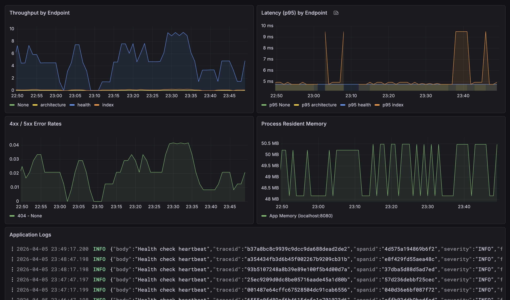

```text
 _  __               _                  
| |/ /___ _   _ ___ | |_ ___  _ __   ___ 
| ' // _ \ | | / __|| __/ _ \| '_ \ / _ \
| . \  __/ |_| \__ \| || (_) | | | |  __/
|_|\_\___|\__, |___/ \__\___/|_| |_|\___|
          |___/                          
```


**Keystone** is a modular, cost-optimized, and highly observable AWS infrastructure showcase project. 

On top of being a boilerplate template, this repository stands as a comprehensive demonstration of modern architectural patterns. It illustrates how to deploy a containerized Python (Flask) web application on Amazon ECS Fargate while maintaining strict security perimeters and driving down enterprise cloud costs through clever engineering choices.

#### For the archictecture diagram, visit the demo page! 
[http://demo.edenkeystone.com](http://demo.edenkeystone.com)

## Architectural Showcase & Design Decisions

This project embodies several major design philosophies to achieve enterprise-grade security without exorbitant cloud bills:

### 1. Cost-Optimized Egress (EC2 custom instance over AWS NAT Gateway)
Typical private-subnet architectures rely on managed AWS NAT Gateways, which incur a fixed ~$32/month baseline cost plus data processing fees. Keystone avoids this entirely by leveraging an **EC2 instance**. This highly efficient NAT alternative reduces baseline egress networking costs to roughly **$3/month** while retaining isolated, private subnet functionality for the ECS tasks.

### 2. Zero Trust & Edge Security via Cloudflare
The traditional Application Load Balancer (ALB) and public inbound port paradigm is replaced in favor of Cloudflare edge security.
*   **WAF & Rate Limiting:** All perimeter defense, web application firewall rules, and rate-limiting mechanisms happen at the Cloudflare edge before bad actors ever reach AWS.
*   **Zero Trust Tunnel Sidecar:** The ECS Fargate task runs a `cloudflared` sidecar container. It establishes an encrypted, outbound-only tunnel back to the Cloudflare edge. There are **zero inbound ports** open to the internet in the VPC.
*   **Infrastructure as Code DNS:** DNS routing is seamlessly automated via Terraform leveraging the Cloudflare provider.

### 3. Comprehensive Observability 
Every metric, trace, and log pushes out to **Grafana Cloud**:
*   **OpenTelemetry & Grafana Alloy:** The Flask application is instrumented to export telemetry. A lightweight, standalone **Grafana Alloy** sidecar within the ECS task collects and securely pushes these traces/metrics to Grafana Prometheus and Tempo.
*   **Direct VPC Flow Logs:** Kinesis Data Firehose ingests AWS VPC Flow Logs and streams them directly into Grafana Loki, delivering granular network observability without requiring intermediary logging endpoints.

---

## Observability Showcase

Keystone provides a unified, glassmorphism-inspired Grafana dashboard for real-time monitoring of ECS Fargate tasks, application logs, and network traffic.



*(Note: The above screenshot demonstrates the unified observability experience, aggregating Loki logs, Prometheus metrics, and Tempo traces into a single pane of glass).*

*(Note: While the repository structure contains an unused module layout for AWS RDS to preserve flexibility, the live showcase prioritizes strict cost management constraints and does not currently provision a cloud RDS instance).*

---

## Tech Stack

While the architectural setup takes precedence, the underlying technologies include:

- **Application Layer**: Python 3.11+, Flask 3.1,(Local)
- **Compute & Architecture**: Amazon ECS Fargate, EC2 for NAT instance
- **Infrastructure as Code**: Terraform (~> 6.0 AWS), orchestrated by **Terramate** and **Terragrunt**
- **Edge & Security**: Cloudflare (DNS, WAF, Rate Limiting, Zero Trust Tunnels)
- **Observability**: Grafana Cloud (Loki, Prometheus, Tempo), Grafana Alloy, OpenTelemetry
- **CI/CD Automation**: GitHub Actions

---

## Traffic Flow & Lifecycle

To visualize how data moves through Keystone:

1.  **Client Request:** A user visits `demo.edenkeystone.com`.
2.  **Cloudflare Edge:** The request is analyzed by Cloudflare, strictly passing through applied WAF and Rate Limiting policies.
3.  **Cloudflare Tunnel:** If legitimated, it flows through an established secure Cloudflare Tunnel.
4.  **AWS Fargate:** The `cloudflared` sidecar living inside the ECS task receives the tunnel packet and reverse-proxies it instantly to the local Flask container running on port `8080`.
5.  **Telemetry Delivery:** OpenTelemetry gathers performance metrics. The Grafana Alloy sidecar scrapes them locally and efficiently pushes them to Grafana Cloud.
6.  **Egress Traffic:** When the container attempts to download external libraries/dependencies, traffic loops securely out through the EC2 instance in the public subnet.

---

## Getting Started (Local Development)

To explore and test the application layer in an isolated local environment:

### Prerequisites
- Docker and Docker Compose
- Python 3.11+ (optional, if running natively)

### Setup

1. **Clone the Repository**
   ```bash
   git clone https://github.com/tchoupi663/keystone.git
   cd keystone/apps
   ```

2. **Spin up Local Environment**
   ```bash
   docker-compose up --build
   ```
   *   **Application**: [http://localhost:80](http://localhost:80)
   *   **Local Database**: PostgreSQL proxy mapped to `localhost:5432`

---

## Deployment Operations

Infrastructure deployment is meticulously separated into 5 independent layers to mitigate deployment blasts and ensure highly granular state control using **Terramate** and **Terragrunt**. 

### Deployment Prerequisites
- Terraform (`~> 1.5+`) & AWS CLI properly logged in natively
- Terramate & Terragrunt
- Cloudflare & Grafana Cloud API Tokens pre-seeded in AWS Secrets Manager


The `.github/workflows/terraform-plan-apply.yml` automatically dictates this sequencing during CI runs, but manual execution targets the tags:

```bash
terramate run --tags $env$ -- terragrunt init
terramate run --tags $env$ -- terragrunt apply -auto-approve
```

---

## Project Notes 

- **Interactive Architecture Map**: The local application hosts a D3.js architecture flow map on `/architecture`. .
- **Validating Cost-Down Schedules**: Fargate's autoscaling (e.g., entirely scaling to zero at night) relies on `aws_appautoscaling_scheduled_action`.
- **State Locks**: If `terragrunt apply` halts on state lock acquisition, it invariably means the CI/CD IAM runner profile lacks stringent lockfile write credentials.
